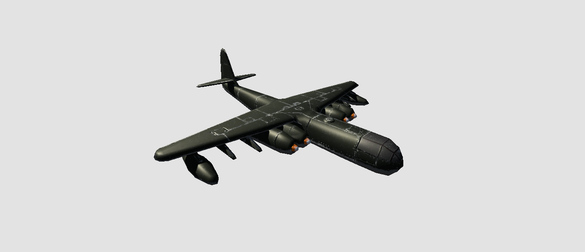

# Voxelizer

A vertex shader that turns meshes into their "cubic" counterparts, by rounding each vertex's position to the nearest voxel of a certain size. 

It's a single variable and a 3 line shader. Funky effects though!

# Usage

Apply the shader to your material and play around with the given variable. The mesh is computed in world space, so different positions provide different results.

# Example

Here's a before and after using the shader:

 
 
 # Consider buying me a coffee if you like my work (click the image)

